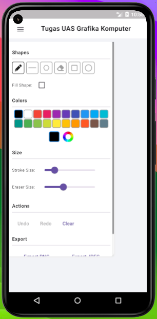
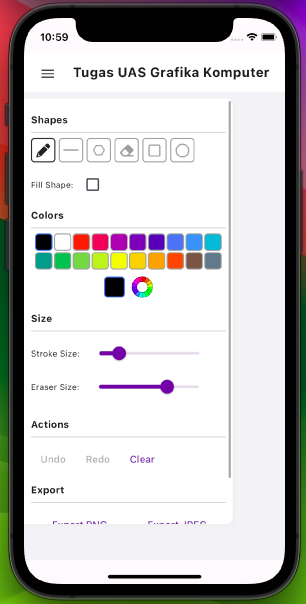

# TUGAS UAS Grafika Komputer Semester 6

Aplikasi sederhana menggambar 2D berbasis Mobile App

## 💻 Persyaratan

- Didukung semua OS seperti MacOS, Linux, Windows.
- Didukung semua text editor seperti Android Studio, dan VSCode.
- Sedikit pengetahuan tentang Bahasa pemrograman Dart and Framework Flutter.

## ✨ Fitur

#### Fitur tersedia
- [x] Scribble.
- [x] Draw Shapes (Line, Polygon, Ellipse and Rectangle).
- [x] Eraser.
- [x] Undo and Redo.

## 📸 ScreenShots

